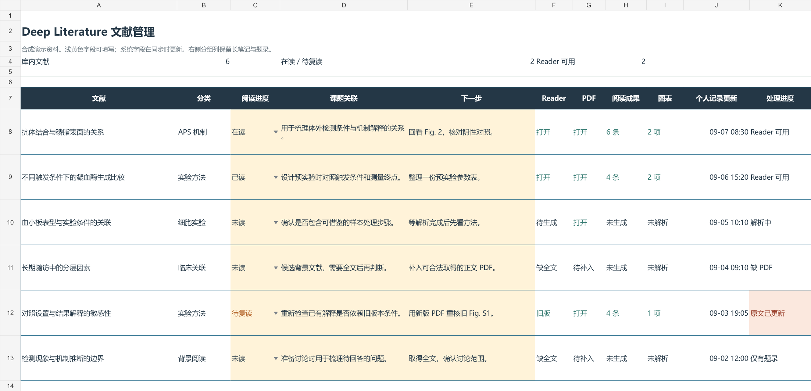
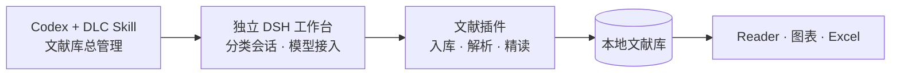

<p align="center">
  
</p>

<h1 align="center">DLC · Deep Literature for Codex</h1>

<p align="center"><strong>在 Codex 里读论文，把理解留在自己的文献库。</strong></p>

<p align="center">
  <a href="https://github.com/TyrionH-is-coding/deep-literature-for-codex/actions/workflows/ci.yml"></a>
  <a href="https://github.com/TyrionH-is-coding/deep-literature-for-codex/actions/workflows/platform-install.yml"></a>
  <a href="LICENSE"></a>
</p>

<p align="center">
  <a href="#快速开始">快速开始</a> ·
  <a href="docs/getting-started.md">使用指南</a> ·
  <a href="docs/platforms.md#从-main-源码测试">Mac 主线测试</a> ·
  <a href="#版本与路线">版本与路线</a> ·
  <a href="https://github.com/TyrionH-is-coding/deep-literature-for-codex/issues">反馈问题</a>
</p>

DLC 是一个由 **Codex 统筹、DeepSeek Harness（DSH）承载**的文献工作台。给它 DOI、论文链接或本地 PDF，就可以建立文献记录、获取可用全文、生成双语阅读页，再把证据和自己的思考积累下来。

**Windows · macOS · Linux**，安装器准备独立运行环境。你提供模型账号或 API，以及用于云端解析的 MinerU Key。

> **已发布：rc.6 公测版。主线：rc.8 开发候选。** 下文的六项个人记录和新设置页对应主线；测试这些改动请使用 [main 安装步骤](docs/platforms.md#从-main-源码测试)。[rc.6 安装包](https://github.com/TyrionH-is-coding/deep-literature-for-codex/releases/tag/v0.1.0-rc.6)保持独立。

## DLC 帮你留下什么？

| 从哪里开始 | DLC 帮你完成 | 留在文献库里 |
| --- | --- | --- |
| **一篇想读的论文** | 核对题录、去重入库、尝试获取 OA 全文；也可补入自己的 PDF | 题录、摘要、分类与正文 |
| **一份待理解的 PDF** | 解析正文、图表和公式，分批翻译、复核，生成双语 Reader | 中英对照阅读页、图表资产与来源位置 |
| **一次阅读后的思考** | 用 Excel 记录进度、课题关系与笔记，按分类或关键词找回 | 可继续维护的个人记录、阅读成果与图表索引 |

**导入论文 → 获取正文 → 双语精读 → 记录与回顾 → 下次接着读。**

## 快速开始

### 1. 让 Codex 帮你安装

在 Codex 新对话中复制发送：

```text
请帮我安装 DLC（Deep Literature for Codex）：
https://github.com/TyrionH-is-coding/deep-literature-for-codex

按我的系统和架构选择 rc.6 Release 安装包，核对 SHA256，
运行安装器并安装 Skill，然后启动工作台。
有内置浏览器工具时打开页面；需要账号授权时由我本人完成。
```

安装需要联网，无需预装 Node、Python 或 DSH。安装后使用 **`$deep-literature-for-codex`** 打开和管理工作台；新安装的 Skill 需要在新对话中使用。

<details>
<summary><strong>手动安装，或测试 main 的 rc.8 修复</strong></summary>

从 [Releases](https://github.com/TyrionH-is-coding/deep-literature-for-codex/releases) 下载与你的系统和架构对应的压缩包，核对 `SHA256SUMS.txt`，解压后进入安装包目录。

| 系统 | 安装包后缀 | 安装入口 |
| --- | --- | --- |
| Windows x64 | `win-x64.zip` | `install.ps1` |
| macOS Apple Silicon / Intel | `darwin-arm64.tar.gz` / `darwin-x64.tar.gz` | `install.sh` |
| Linux ARM64 / x64 | `linux-arm64.tar.gz` / `linux-x64.tar.gz` | `install.sh` |

Windows：

```powershell
powershell.exe -NoProfile -File .\install.ps1 -PluginArchive .\inputs\scientific-reading.tgz -InstallSkill
```

macOS / Linux：

```sh
sh ./install.sh --plugin-archive ./inputs/scientific-reading.tgz --install-skill
```

**测试主线：** 按[源码测试步骤](docs/platforms.md#从-main-源码测试)取得 `main`，再运行对应安装器。源码已包含固定 SHA 的引擎包；仅 `git pull` 不会更新已安装的实例。升级时指向原来的安装目录。

详细的下载校验、运行条件、自定义目录与启停命令见[平台指南](docs/platforms.md)。

</details>

### 2. 配置模型与解析服务

打开工作台的 **“设置与状态”**，完成两项配置：

| 配置 | 用途 | 如何开始 |
| --- | --- | --- |
| **MinerU API Key** | 将 PDF 解析成正文、图表与公式 | 从自己的 MinerU 账号取得 Token，在“全文解析”中保存。[配置教程](docs/mineru-api-key.md) |
| **模型接入** | 翻译、导读与讨论 | 使用 DSH 原生模型 API，或打开工作台自己的 Codex 订阅入口，由本人授权后选择可用模型。[操作步骤](docs/getting-started.md#2-选择用于翻译的模型) |

工作台需要自己的模型配置；外层 Codex 登录不会自动同步。模型与解析服务使用你自己的账号额度，保存 Key 后还需通过真实任务确认服务可用。

### 3. 读第一篇论文

配置完成后，告诉 Codex：

```text
使用 DLC，创建“机器学习”分类。
把 Attention Is All You Need 加入这个分类并开始精读：
https://doi.org/10.48550/arXiv.1706.03762

先尝试获取开放获取 PDF，取得后继续解析、翻译与复核。
无法取得时告诉我需要补什么；完成后打开正式 Reader。
```

缺少全文时，提供自己有权使用的 PDF 路径，让 Codex **补入原任务并继续**。详细的模型选择、补 PDF 与中断续接步骤见[第一篇论文指南](docs/getting-started.md#第三步获取并精读第一篇论文)。

## 把阅读变成长久积累

读完以后，可以在 Excel 里留下：**阅读进度、与课题的关系、下一步、个人思考、个人理解程度、用户笔记**。以后按分类、关键词或阅读进度找回论文，从同一条记录打开 PDF、Reader 和图表。



*上图为合成数据的设计 Demo，展示长期管理方式；实际安装使用正式引擎生成总表。[示例说明](docs/media/README.md)*

| 工作表 | 你可以查看 |
| --- | --- |
| **文献** | 题录、分类、摘要、六项个人记录及阅读入口 |
| **阅读成果** | 研究问题、方法、关键结论、局限及其证据位置 |
| **图表索引** | 图表、图注、页码和有证据引用的关联成果 |
| **说明** | 可编辑字段与同步规则 |

修改个人记录后，**保存并关闭工作簿，再让 Codex 同步与刷新**。遇到文件占用或两边修改冲突时保留原表并提示处理。生成 Reader 不会自动把论文标成“已读”。[完整 Excel 教程 →](docs/excel-library.md)

## 基于 DSH，一切皆插件

**DLC** 是 **Deep Literature for Codex** 的简称，也呼应了“扩展包”的意思：给 Codex 补上文献工作的能力。

它沿用 DSH“一切皆插件”的思路：文献流程由插件提供，DSH 承载会话与模型，Codex 通过 Skill 统筹整个文献库。安装器为 DLC 准备独立的运行环境、配置和数据目录，与你已有的 DSH 安装分开。



文献库以 SQLite 保存记录，Excel 是便于查看和有限回写的入口。程序和文献资产保存在本机；使用 MinerU API 时会上传 PDF，模型请求会将所需内容发送给所选服务。

已有 DSH、希望单独使用文献插件，可以查看 [DSH Scientific Reading](https://github.com/TyrionH-is-coding/dsh-scientific-reading)。该插件只自动获取 OA 全文或接收本地 PDF；DLC 中的机构访问由外层 Codex 配合可用浏览器与本人授权处理。

## 版本与路线

| 版本 | 状态与范围 |
| --- | --- |
| **rc.6 公测版** | 已发布跨平台安装包；包含文献入库、OA 获取、MinerU、双语 Reader 和 Excel。[下载](https://github.com/TyrionH-is-coding/deep-literature-for-codex/releases/tag/v0.1.0-rc.6) |
| **main / rc.8** | 六项个人记录与安全同步、新设置页、模型进程恢复、翻译草稿保留与有限补试。正在补齐 Mac 实机测试。[源码测试](docs/platforms.md#从-main-源码测试) · [改动说明](docs/release-engineering-review.md) |
| **v0.2 待做** | 每篇文献一个 chat、多选 chat 总结、Figure 关联讨论、Excel 字段与 HTML 模板自定义、主题色、文献雷达。[分类清单](docs/roadmap-v0.2.md) |

当前 v0.1 使用分类管理会话。跨平台 CI 和安装检查不能代替本人 OAuth、真实长文翻译及 Excel / Numbers / LibreOffice 桌面编辑回写验收；任务仍可能需要继续或纠错提示，译文与科学结论需要结合原文判断。[验证记录](docs/acceptance.md) · [模型测试](docs/model-tests.md)

## 常见问题

<details>
<summary><strong>所有论文都能自动下载吗？</strong></summary>

自动流程只获取有开放来源依据的 OA 全文，当前固定流程默认使用 arXiv 和 Europe PMC。机构文献取决于本人访问权限、浏览器工具和网站状态；遇到登录或验证时由本人处理，也可以手动下载后补入原任务。

ScanSci PDF 上游的所有来源和登录功能并未全部启用；Unpaywall 所需的联系邮箱尚无工作台配置入口。[全文获取说明](docs/getting-started.md#scansci-pdf-如何帮你取得全文)

</details>

<details>
<summary><strong>已经安装了 DSH，或已经登录 Codex，还需要配置吗？</strong></summary>

DLC 使用独立 DSH 实例，不自动读取其他 DSH 的配置或外层 Codex 登录。请在工作台配置模型 API，或通过工作台订阅页完成本人授权；可用模型以实际账号返回为准。

</details>

<details>
<summary><strong>以后怎么继续？换机器怎么带走文献？</strong></summary>

告诉 Codex“使用 DLC 打开原来的工作台，从这篇论文当前进度继续”。关闭浏览器不会停止后台，端口也可能变化，请使用本次启动返回的地址。

迁移时备份完整文献库；只复制 Excel 不包含 PDF、Reader 和任务数据。模型授权与 MinerU Key 需要在新机器重新配置。[备份、升级与恢复](docs/lifecycle.md)

</details>

## 文档与参与

| 我想…… | 从这里开始 |
| --- | --- |
| 从安装到第一篇精读完整走一遍 | [使用指南](docs/getting-started.md) |
| 在 Windows、Mac 或 Linux 安装、测试主线 | [平台指南](docs/platforms.md) |
| 配置解析与模型 | [MinerU Key](docs/mineru-api-key.md) · [订阅接入](docs/oauth.md) |
| 管理笔记、同步总表与迁移数据 | [Excel 教程](docs/excel-library.md) · [生命周期](docs/lifecycle.md) |
| 了解后续计划或参与改进 | [v0.2 路线](docs/roadmap-v0.2.md) · [Issues](https://github.com/TyrionH-is-coding/deep-literature-for-codex/issues) |

欢迎提交使用反馈、文档改进与修复。报告问题时附上版本、系统、复现步骤、错误文字及去除凭据的截图；工程验证可运行 `npm test`，OAuth 测试和跨平台安装步骤见 [CI](https://github.com/TyrionH-is-coding/deep-literature-for-codex/blob/main/.github/workflows/ci.yml) 与[安装工作流](https://github.com/TyrionH-is-coding/deep-literature-for-codex/blob/main/.github/workflows/platform-install.yml)。

## 致谢与许可

DLC 基于 [DeepSeek Harness](https://github.com/deepseek-ai/deepseek-harness) 构建，使用 [MinerU](https://github.com/opendatalab/MinerU) 解析论文；OA 获取接入 [ScanSci PDF](https://github.com/Rimagination/scansci-pdf) 的固定模块（Apache-2.0），订阅接入基于 [DSH OpenAI OAuth](https://github.com/DGPisces/dsh-openai-oauth) 与官方 Codex CLI。

本项目控制代码与 Skill 使用 **[BSD-3-Clause](LICENSE)**。各依赖保留其原有许可，完整说明见 [THIRD_PARTY_NOTICES.md](THIRD_PARTY_NOTICES.md)。
